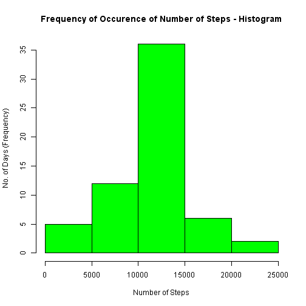

# Peer Assessment 1
===================

## 1. Loading and Preprocessing the data  
Make sure the data file is present in the current directory where the program resides and runs


```r
mydata = read.csv("activity.csv")  
```

## 2. Mean Total Number of Steps taken per day  

### 2a. Calculate the Total Number of Steps per day

```r
library(lattice)
mydata$date <- as.Date(mydata$date, format = "%Y-%m-%d")
steps_by_day_agg_mydata <- aggregate(steps~date, mydata, sum, na.rm=TRUE)
head(steps_by_day_agg_mydata)
```

```
##         date steps
## 1 2012-10-02   126
## 2 2012-10-03 11352
## 3 2012-10-04 12116
## 4 2012-10-05 13294
## 5 2012-10-06 15420
## 6 2012-10-07 11015
```

### 2b. Bar Plot of the Total Number of Steps Day Wise

```r
barplot(steps_by_day_agg_mydata$steps, names.arg=steps_by_day_agg_mydata$date, main="Number of Steps - Day Wise - Bar Plot", xlab="Date", ylab="No. of Steps", col="blue")
```

 

### 2c. Histogram of Frequency of Occurence of Each Total Number of steps in a day


```r
hist(steps_by_day_agg_mydata$steps, main="Frequency of Occurence of Number of Steps - Histogram", xlab="Number of Steps", ylab="No. of Days (Frequency)", col="green")
```

 

### 2d. Mean and Median Calculation for Total Number of steps per day

```r
mean(steps_by_day_agg_mydata$steps)
```

```
## [1] 10766.19
```

```r
median(steps_by_day_agg_mydata$steps)
```

```
## [1] 10765
```

## 3. Average Daily Activity Pattern

### 3a. Time Series Plot - Avergae Number of Steps across All Days over 5 Minute Intervals

```r
avg_steps_by_interval_agg_mydata <- aggregate(steps~interval, mydata, mean, na.rm=TRUE)
plot(avg_steps_by_interval_agg_mydata$interval, avg_steps_by_interval_agg_mydata$steps, type="l", col="blue", main="Avg. Number of Steps over 5 Minute Intervals - Time Series Plot", xlab="Interval", ylab="Avg. number of Steps")
```

 

### 3b. 5-Minute interval with maximum average number of steps

```r
interval_with_max_steps <- avg_steps_by_interval_agg_mydata$interval[which.max(avg_steps_by_interval_agg_mydata$steps)]
```
5-Minute interval with maximum average number of steps  = 835  

## 4. Inputting Missing Values

### 4a. Calculate and Report Total Number of missing values - rows with NAs

```r
num_missing_values_records = sum(!complete.cases(mydata))
```
Total Number of missing values records = 2304  

### 4b. Devise strategy for filling missing Value Records - rows with NAs steps column in input dataset

Strategy - NAs to be replaced by the average/mean number of steps of the 5 minute interval across all days  


```r
avg_steps_by_interval_agg_mydata <- aggregate(steps~interval, mydata, mean, na.rm=TRUE)
filled_NA_col_values <- numeric()

for ( i in 1:nrow(mydata)) 
{
    curr_row <- mydata[i,]
    if (is.na(curr_row$steps))
    {
        steps <- subset(avg_steps_by_interval_agg_mydata, interval == curr_row$interval)$steps
    }
    else
    {
        steps <- curr_row$steps
    }      
  filled_NA_col_values = c(filled_NA_col_values, steps)
}
```

### 4c. Create new dataset with filled missing values

```r
new_mydata <- read.csv("activity.csv")
new_mydata$date <- as.Date(new_mydata$date, format = "%Y-%m-%d")
head(new_mydata)
```

```
##   steps       date interval
## 1    NA 2012-10-01        0
## 2    NA 2012-10-01        5
## 3    NA 2012-10-01       10
## 4    NA 2012-10-01       15
## 5    NA 2012-10-01       20
## 6    NA 2012-10-01       25
```

```r
new_mydata$steps <- filled_NA_col_values
head(new_mydata)
```

```
##       steps       date interval
## 1 1.7169811 2012-10-01        0
## 2 0.3396226 2012-10-01        5
## 3 0.1320755 2012-10-01       10
## 4 0.1509434 2012-10-01       15
## 5 0.0754717 2012-10-01       20
## 6 2.0943396 2012-10-01       25
```

```r
num_missing_values_records_after_fill = sum(!complete.cases(new_mydata))
```

Total Number of missing values records after filling NA records = 0  

### 4d. Create Histogram and Calculate new mean and median for the new dataset

```r
new_steps_by_day_agg_new_mydata <- aggregate(steps~date, new_mydata, sum, na.rm=TRUE)
hist(new_steps_by_day_agg_new_mydata$steps, main="Frequency of Occurence of Number of Steps - Histogram", xlab="Number of Steps", ylab="No. of Days (Frequency)", col="green")
```

 

### 4e. Mean and Median Calculation for Total Number of steps per day for new dataset
The new mean and the new median as below - the mean is not changed but the median has little variation  

```r
mean(new_steps_by_day_agg_new_mydata$steps)
```

```
## [1] 10766.19
```

```r
median(new_steps_by_day_agg_new_mydata$steps)
```

```
## [1] 10766.19
```

## 5. Comparison between Activity Pattern of weekdays and weekends

```r
day_type <- weekdays(new_mydata$date)
day_type_level <- vector()

for ( i in 1:nrow(new_mydata)) 
{
    if (day_type[i] == "Saturday")
    {
      day_type_level[i] = "Weekends"
    }
    else if (day_type[i] == "Sunday")
    {
      day_type_level[i] = "Weekends"
    } 
    else
    {
        day_type_level[i] = "Weekdays"
    }      
}
new_mydata$day_type_level <- day_type_level
new_mydata$day_type_level <- factor(new_mydata$day_type_level)
avg_steps_by_interval_agg_new_mydata <- aggregate(steps ~ interval + day_type_level, new_mydata, mean, na.rm=TRUE)
xyplot(steps ~ interval | day_type_level, avg_steps_by_interval_agg_new_mydata, type="l", layout = c(1,2), xlab="Interval", ylab="Avg. Number of Steps")
```

 
